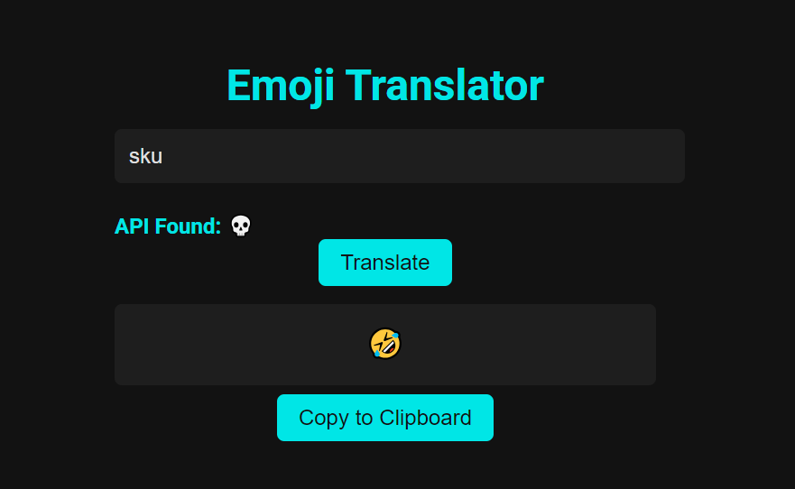

# 🌟 Emoji Translator 🌟

Welcome to the **Emoji Translator**! This project allows you to translate words into emojis 🐱 ➡️ 😺. It's a fun, interactive, and simple way to work with words and symbols.

---

## 📸 Screenshots

How it works! 👀



---

## 🚀 How to Use

1. **Clone the Repository**:
   ```bash
   git clone https://github.com/Antot-12/Emoji-Translator.git

2. **Open the Project**:
   Navigate to the folder and open `index.html` in your browser.

3. **Start Typing**:
   Type any word in the input field, and the app will show suggestions and translate it into emojis.

4. **Copy the Translation**:
   Once translated, click the "Copy to Clipboard" button to use the emojis anywhere! 📋

---

## 🛠️ Tech Stack

- **HTML**: Structure of the app.
- **CSS**: Styling, including a sleek dark mode 🎨.
- **JavaScript**: Core logic for real-time suggestions, translations, and API calls.

---

## 📂 Project Structure

```
emoji-translator/
│
├── index.html        # Main HTML file
├── styles.css        # CSS file for styling
├── script.js         # JavaScript logic
├── screens/          # Folder for screenshots
│   └── screenshot.png
└── README.md         # This file
```

---